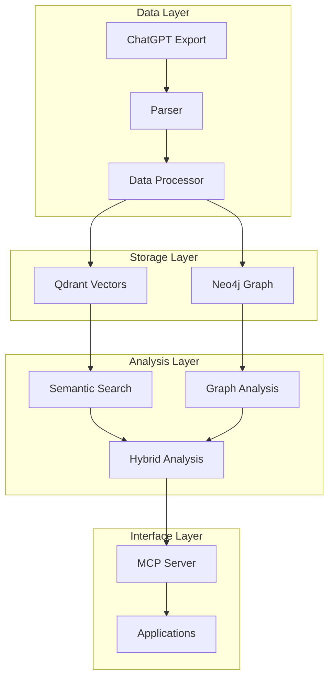

# ChatGPT Neo4j-Qdrant Hybrid Knowledge Graph Analyzer

A hybrid system that combines vector embeddings and knowledge graphs to analyze ChatGPT conversations, enabling semantic search, concept extraction, and relationship analysis.

## Features

🔍 **Semantic Analysis**
- Vector embeddings for semantic similarity
- Concept extraction and relationship mapping
- Topic evolution tracking
- Cross-conversation analysis

🕸️ **Knowledge Graph**
- Conversation threading and relationships
- Entity and concept mapping
- Pattern recognition
- Graph-based navigation

📊 **Analytics**
- Conversation metrics
- Interaction patterns
- Topic diversity analysis
- Temporal analysis

🔄 **Flexible Import**
- Native ChatGPT export support
- Multiple format handling
- Batch processing
- Data validation

## Architecture



See [ARCHITECTURE.md](docs/ARCHITECTURE.md) for detailed architecture documentation.

## Prerequisites

- Python 3.8+
- Docker and Docker Compose
- Neo4j 5.x
- Qdrant

## Quick Start

1. Clone the repository:
```bash
git clone https://github.com/rebots-online/ChatGPT-neo4j-qdrant-hybrid-knowledge-graph-analyzer.git
cd ChatGPT-neo4j-qdrant-hybrid-knowledge-graph-analyzer
```

2. Set up environment:
```bash
cp .env.example .env
# Edit .env with your settings
```

3. Start services:
```bash
docker compose up -d
```

4. Install dependencies:
```bash
pip install -e .
```

5. Initialize databases:
```bash
python scripts/init_databases.py
```

## Usage

### Import Conversations

```python
from chat_analyzer import ChatAnalyzer

analyzer = ChatAnalyzer()
analyzer.import_conversations("path/to/export.zip")
```

### Semantic Search

```python
results = analyzer.semantic_search(
    query="machine learning applications",
    limit=10,
    min_score=0.7
)
```

### Knowledge Graph Analysis

```python
concepts = analyzer.extract_concepts(
    conversation_id="conv-123",
    min_relevance=0.5
)

relationships = analyzer.analyze_relationships(
    concept_id="concept-456",
    max_depth=3
)
```

### Analytics

```python
metrics = analyzer.analyze_metrics(
    conversation_id="conv-123",
    metrics=[
        "message_frequency",
        "response_times",
        "topic_diversity"
    ]
)
```

## MCP Integration

Add to your `claude_desktop_config.json`:

```json
{
  "mcpServers": {
    "chat-analysis": {
      "command": "python",
      "args": ["-m", "chat_analyzer.server"],
      "env": {
        "QDRANT_URL": "http://localhost:6333",
        "NEO4J_URL": "bolt://localhost:7687",
        "NEO4J_USER": "neo4j",
        "NEO4J_PASSWORD": "your-password"
      }
    }
  }
}
```

## Development

See [CONTRIBUTING.md](docs/CONTRIBUTING.md) for development guidelines.

### Running Tests

```bash
pytest tests/
```

### Code Style

```bash
black .
flake8 .
mypy .
```

## Roadmap

See [ROADMAP.md](docs/ROADMAP.md) for planned features and development timeline.

## Architecture

See [ARCHITECTURE.md](docs/ARCHITECTURE.md) for detailed system design documentation.

## Contributing

1. Fork the repository
2. Create a feature branch
3. Submit a pull request

See [CONTRIBUTING.md](docs/CONTRIBUTING.md) for detailed guidelines.

## License

MIT License - See [LICENSE](LICENSE) file for details.

## Related Projects

- [MCP Chat Analysis Server](https://github.com/rebots-online/mcp-chat-analysis-server)
- [Neo4j Graph Database](https://neo4j.com/)
- [Qdrant Vector Database](https://qdrant.tech/)
- [sentence-transformers](https://www.sbert.net/)

## Support

- 📖 [Documentation](docs/)
- 🐛 [Issue Tracker](https://github.com/rebots-online/ChatGPT-neo4j-qdrant-hybrid-knowledge-graph-analyzer/issues)
- 💬 [Discussions](https://github.com/rebots-online/ChatGPT-neo4j-qdrant-hybrid-knowledge-graph-analyzer/discussions)