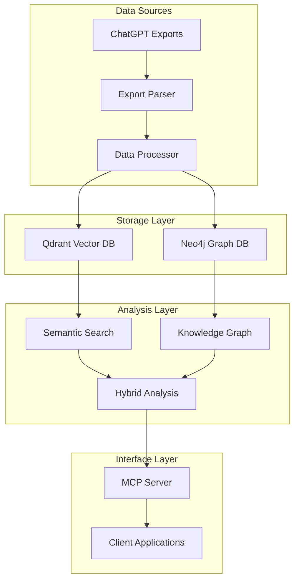
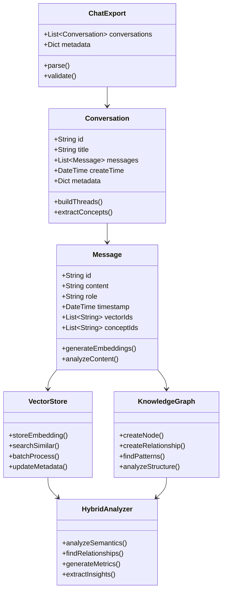
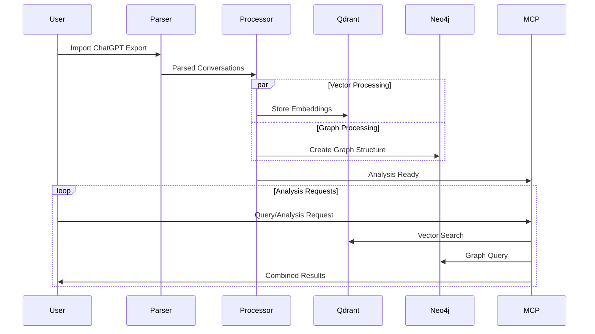
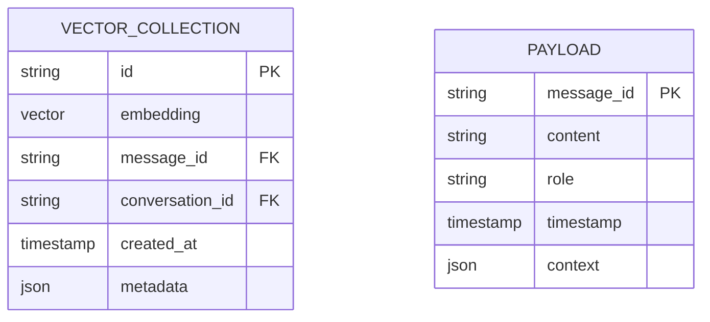
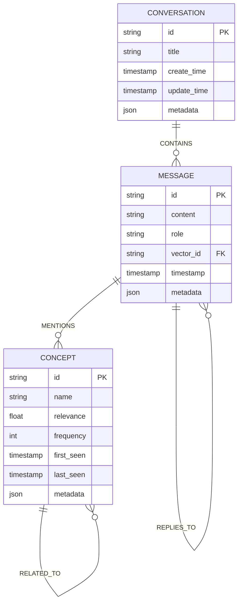
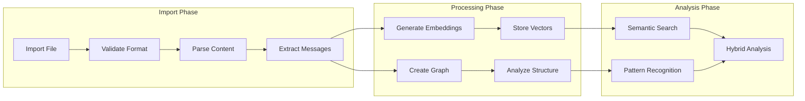
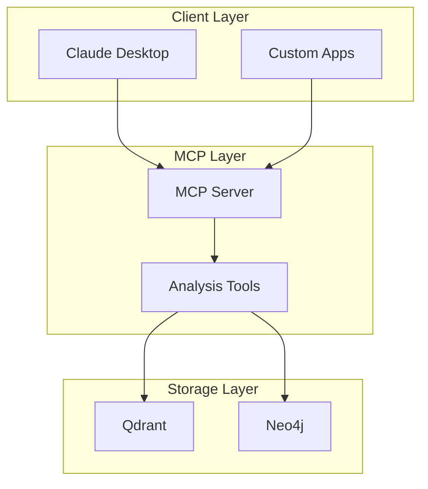

# Architecture Documentation

## System Overview



## Component Architecture



## Data Flow



## Storage Schema

### Vector Storage (Qdrant)



### Graph Storage (Neo4j)



## Processing Pipeline



## Integration Architecture



## Deployment Architecture

```mermaid
graph TB
    subgraph "Application Tier"
        MCP[MCP Server]
        API[Analysis API]
    end
    
    subgraph "Database Tier"
        Qdrant[Qdrant Vector DB]
        Neo4j[Neo4j Graph DB]
    end
    
    subgraph "Client Tier"
        Claude[Claude Desktop]
        Web[Web Interface]
        CLI[Command Line]
    end
    
    Claude --> MCP
    Web --> API
    CLI --> API
    MCP --> API
    API --> Qdrant
    API --> Neo4j