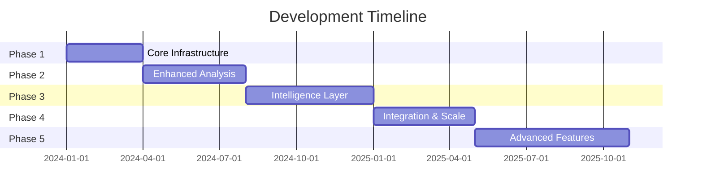

# Project Roadmap

## Phase 1: Core Infrastructure (Current)

### Data Import & Storage
- [x] Basic ChatGPT export parsing
- [x] Neo4j database setup
- [x] Qdrant vector database integration
- [x] MCP server implementation
- [ ] Support for multiple export formats
- [ ] Batch processing capabilities

### Analysis Foundation
- [x] Vector embedding generation
- [x] Basic knowledge graph structure
- [ ] Initial concept extraction
- [ ] Basic semantic search
- [ ] Simple metrics calculation

## Phase 2: Enhanced Analysis (Next)

### Advanced Processing
- [ ] Improved conversation threading
- [ ] Context-aware embedding generation
- [ ] Multi-level concept extraction
- [ ] Relationship pattern detection
- [ ] Topic evolution tracking

### Search & Discovery
- [ ] Advanced semantic search with filters
- [ ] Concept-based navigation
- [ ] Cross-conversation analysis
- [ ] Temporal pattern analysis
- [ ] Knowledge graph visualization

### Analytics
- [ ] Conversation quality metrics
- [ ] Interaction pattern analysis
- [ ] Topic diversity measurement
- [ ] Response time analytics
- [ ] Engagement scoring

## Phase 3: Intelligence Layer

### Machine Learning
- [ ] Automated topic modeling
- [ ] Sentiment analysis
- [ ] Intent recognition
- [ ] Conversation flow analysis
- [ ] Anomaly detection

### Knowledge Extraction
- [ ] Automated knowledge base construction
- [ ] Fact extraction and verification
- [ ] Entity relationship mining
- [ ] Knowledge graph enrichment
- [ ] Cross-reference with external sources

### Insights Generation
- [ ] Conversation summarization
- [ ] Key insights extraction
- [ ] Trend analysis
- [ ] Pattern recommendations
- [ ] Quality improvement suggestions

## Phase 4: Integration & Scale

### API & Integration
- [ ] RESTful API development
- [ ] GraphQL interface
- [ ] Webhook support
- [ ] Real-time processing
- [ ] Streaming analytics

### Performance & Scale
- [ ] Distributed processing
- [ ] Caching layer
- [ ] Performance optimization
- [ ] Horizontal scaling
- [ ] High availability setup

### Security & Compliance
- [ ] Access control implementation
- [ ] Data encryption
- [ ] Audit logging
- [ ] Privacy controls
- [ ] Compliance documentation

## Phase 5: Advanced Features

### Visualization & UI
- [ ] Interactive graph visualization
- [ ] Analytics dashboard
- [ ] Custom report generation
- [ ] Real-time monitoring
- [ ] Mobile interface

### Advanced Analytics
- [ ] Predictive analytics
- [ ] Behavioral modeling
- [ ] A/B testing support
- [ ] Custom metric creation
- [ ] Comparative analysis

### Automation
- [ ] Automated tagging
- [ ] Smart categorization
- [ ] Alert system
- [ ] Scheduled analysis
- [ ] Automated reporting

## Future Considerations

### Research Areas
- Natural Language Understanding improvements
- Advanced knowledge representation
- Contextual embedding techniques
- Graph neural networks
- Transfer learning applications

### Integration Opportunities
- Integration with other chat platforms
- External knowledge base connections
- API marketplace development
- Plugin system
- Third-party tool integration

### Community & Ecosystem
- Open source contributions
- Plugin development support
- Community templates
- Use case documentation
- Training materials

## Timeline

## Success Metrics

### Technical Metrics
- Query response time < 100ms
- 99.9% system uptime
- 100% data integrity
- Zero data loss
- Linear scaling capability

### User Metrics
- Positive user feedback
- Feature adoption rate
- System usage metrics
- Error rate reduction
- User satisfaction scores

### Business Metrics
- Implementation success rate
- Time to value
- Resource utilization
- Cost efficiency
- ROI measurements

## Contributing

See [CONTRIBUTING.md](CONTRIBUTING.md) for guidelines on how to contribute to specific roadmap items.

## Feedback

We welcome feedback and suggestions on this roadmap. Please open an issue or discussion to share your thoughts.